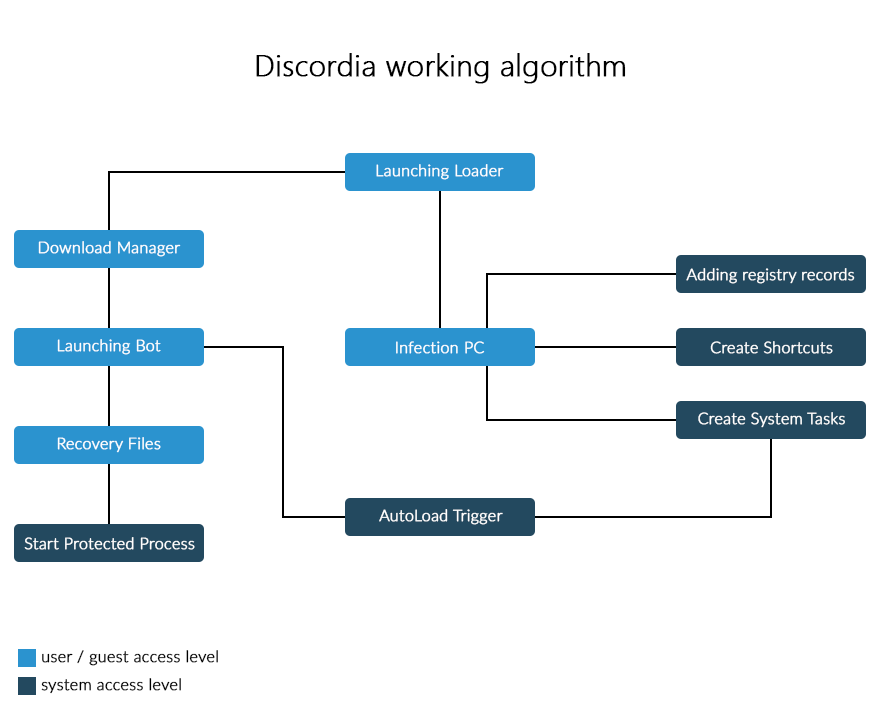

# Discordia
Discordia it's Universal Trojan. Discordia written on C++.

## Features
* **Hiding files**
* **Working on user-mode / guest-mode** (non-admin account)
* **Deny access to protected process** (working on Windows XP, Windows Vista, Windows 7, Windows 8, Windows 8.1)
* **Automatic recovery files**
* **Three autoload methods** (Registry, Shortcut, Task)
* **Automatic restart process**
* **Automatic re-infection PC** (Powershell script)

## How it Works

